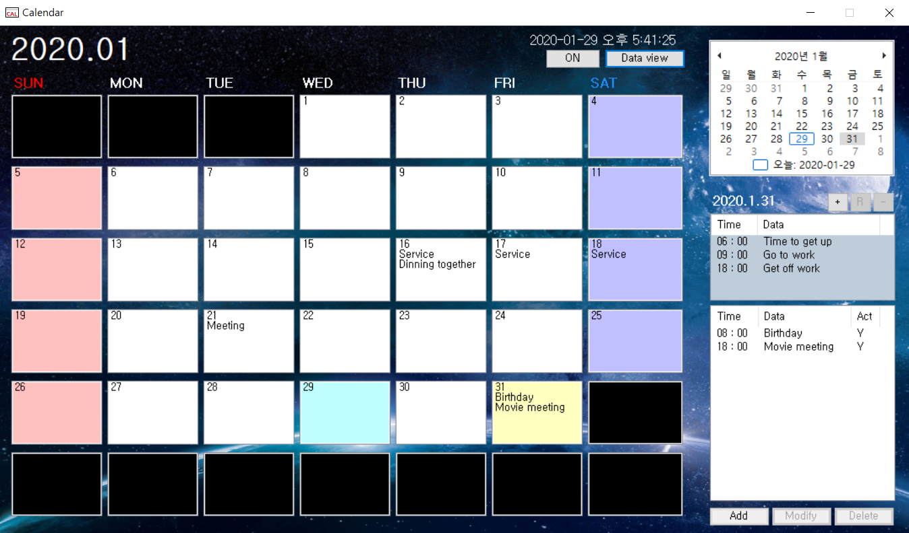

# Calendar_personal_project 
 - Using C# WinForm to Implement a Calendar Program
---------------------------------------

## Preview (미리보기)

---------------------------------------

## Features (특징)
	- Supports add, modify, delete alarms & select multiple alarms (알람 추가, 수정, 삭제 기능 및 다중 선택 지원)
	- Supports daily alarm list (매일 알람 리스트 지원)
	- Strong alarm sound & Alarm ON/OFF support (강력한 알람 사운드 및 알람 ON/OFF 지원)
	- Hide Programs, support tray icon functionality (프로그램 숨김 및 트레이 아이콘 기능 지원)
	- Supports DataView feature to manage all alarms (모든 알람을 관리할 수 있는 DataView 기능 지원)
	- Clean GUI Interface Configuration (깔끔한 GUI 인터페이스 구성)

---------------------------------------

## Commit Log (커밋 로그)
 - [Commit Log (Link)](https://github.com/baedi/Calendar_personal_project/blob/master/CommitLog.md)
 

---------------------------------------

## Helpful data (도움이 된 자료들)

 - https://docs.microsoft.com/ko-kr/dotnet/api/system.datetime.tostring?view=netframework-4.8#System_DateTime_ToString_System_String_
 - https://docs.microsoft.com/ko-kr/dotnet/framework/winforms/controls/how-to-anchor-and-dock-child-controls-in-a-tablelayoutpanel-control
 - https://mirwebma.tistory.com/140
 - https://github.com/baedi/Calender_personal_project
 - (SQLite) http://www.gisdeveloper.co.kr/?p=2290
 - (SQLite) http://www.csharpstudy.com/Practical/Prac-sqlite.aspx
 - (SQLite) https://swconsulting.tistory.com/83
 - (SQLite) https://www.codeproject.com/Articles/22165/Using-SQLite-in-your-C-Application
 - (BadImageFormatException 해결) https://bigenergy.tistory.com/673
 - (string byte 크기 구하기) https://happytomorrow.net/201
 - (SQLite db 파일 읽기) https://happyryu.tistory.com/76
 - (MessageBox YESNO) https://onlyican.tistory.com/152
 - (DB Update) https://spaghetti-code.tistory.com/9
 - (폼 닫기 취소) https://guyaga.tistory.com/56
 - (폼 최소,최대,닫기 없애기) https://terrorjang.tistory.com/40
 - (폼 더블버퍼링) https://cowvoice.tistory.com/8
 - (폼 중앙 띄우기) https://mainia.tistory.com/352
 - (dll exe에 포함시키기 관련 Nuget) https://onlycroco.tistory.com/14
 - (배포 관련 1) https://hunit.tistory.com/330
 - (배포 관련 2) https://blog.naver.com/goldrushing/130166294554
 - (저장된 리소스 가져오기) https://liesm.tistory.com/entry/C-Exe-%ED%8C%8C%EC%9D%BC%EC%97%90-DllOcx-%ED%8C%8C%EC%9D%BC-%ED%8F%AC%ED%95%A8%ED%95%98%EC%97%AC-%EC%BB%B4%ED%8C%8C%EC%9D%BC%ED%95%98%EA%B8%B0
 - (ico 삽입) https://yongtech.tistory.com/55
 - (사운드 재생 관련) https://blog.powerumc.kr/35
 - (사운드 재생 관련 리소스) http://blog.naver.com/PostView.nhn?blogId=hamstery&logNo=110089837046
 - (리소스 이미지 로드) https://akinokaze.tistory.com/201
 - (png -> ico) https://www.hipdf.com/kr/png-to-ico
 - (두 DateTime '일'수 차이 구하기) https://nicebury.tistory.com/60
 - (ListView 항목 복수 선택) https://wwwi.tistory.com/324
 - (트레이 아이콘) https://www.youtube.com/watch?v=TgDKcdC7X3E
 - (단일 프로세스 실행) http://egloos.zum.com/metashower/v/9468289

---------------------------------------

## Etc (기타)

 - DotNet version : 4.5.2
 - Background : [deselect (pixabay.com)](https://pixabay.com/ko/photos/%EB%B2%BD%EC%A7%80-%EA%B3%B5%EA%B0%84-%EB%B0%94%ED%83%95-%ED%99%94%EB%A9%B4-%EC%9A%B0%EC%A3%BC-3584226/)
 - Database : SQLite
 - Database Path : C:\Users\(YourUserName)\Documents\baedi_calendar
 - SQLite version : sqlite-netFx451-setup-bundle-x64-2013-1.0.111.0
 - Alarm Sound source : [LittleT1D (freesound.org)](https://freesound.org/people/LittleT1D/sounds/323019/)
